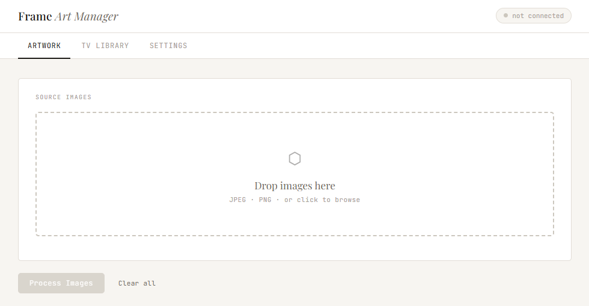

# Frame ▪ Art Manager

A minimal, browser‑based editor that resizes, crops and uploads pictures to a Samsung Frame TV. Everything runs locally.



## Key features

- Drag & drop or browse photos and automatically resize/crop them to the Frame's 3840×2160 canvas.
- Combine portrait shots side‑by‑side (automatic pairing or manual control).
- Download processed files as a ZIP archive or upload directly to a paired TV.
- Browse and delete art already stored on the television.
- Configure matte style, slideshow interval and auto‑activate Art Mode after uploads.
- Settings, pairing token and upload history persist in `localStorage`.


## Getting started

1. Install Python 3 and the `websockets` package:
   ```sh
   python -m pip install websockets
   ```
   The browser cannot open raw TCP sockets, so `relay.py` bridges to the TV.

2. Start the relay in a separate terminal and keep it running while using the web app:
   ```sh
   python relay.py
   ```

3. Open `frame-art-manager.html` in a modern browser on the same network as your Frame TV.
4. If this is the first connection, complete the one‑time certificate trust and pairing steps below.
5. Drag images into the **Source Images** area or click to select files.
6. Click **Process Images** when ready, then download or upload the results.

### One‑time setup

The TV uses a self‑signed certificate on port 8002, so browsers block the WebSocket until you explicitly trust it:

1. Enter the TV IP in the **TV IP Address** field and click **① Trust certificate**. A new tab opens at `https://<TV_IP>:8002`.
2. Use **Advanced → Proceed** to accept the warning.
3. Return to the app and click **Connect**. Authorise the pairing prompt that appears on the TV. A token is stored for future sessions.

> [!tip]
> If the IP changes, clear the token in **Settings** and repeat the trust step.


## Library & settings

- Use the **TV library** tab to view remote content. Filter by `MY-` entries or Samsung’s default images, and delete selected items.
- The **Settings** tab controls matte colour/style, slideshow timing, and offers a button to purge local data.


## Development notes

The app is contained entirely in `frame-art-manager.html`; there are no dependencies or build steps. The global `state` object holds application data, and functions are grouped with labelled comment blocks (e.g. `// ── STATE ──` or `// ── SAMSUNG FRAME TV WEBSOCKET PROTOCOL ──`). Add new UI elements by assigning them IDs and wiring up event listeners near the bottom of the file.

A sequence diagram (`communication-flow.excalidraw`) documents the message exchange between the client and the television. Open it in [Excalidraw] by dragging the file onto the canvas.


## Acknowledgements

The TV communication layer is based on research and reverse-engineering work by [Nick Waterton](https://github.com/NickWaterton/samsung-tv-ws-api), whose `samsung-tv-ws-api` fork documented the `com.samsung.art-app` WebSocket protocol in detail — including the two-phase TCP image upload, content list API, and cross-firmware compatibility fixes for 2021–2024 Frame models. This project would not exist without that work.


## File overview

| File                          | Purpose                                                       |
|------------------------------|---------------------------------------------------------------|
| `frame-art-manager.html`     | Single‑file web application (HTML, CSS, JS)                   |
| `communication-flow.excalidraw` | Visual sequence diagram of app↔TV interaction                  |


[Excalidraw]: https://excalidraw.com

